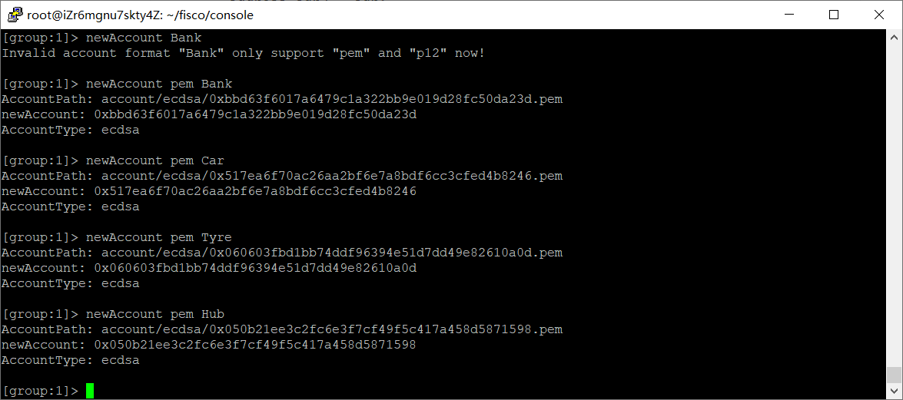
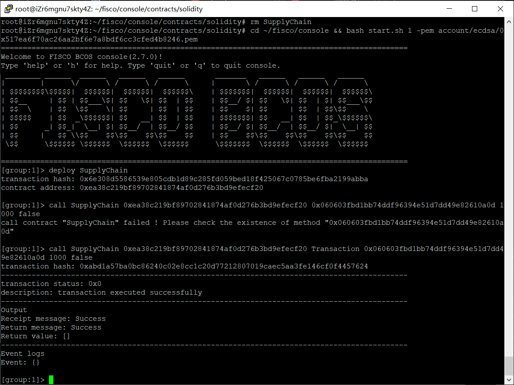
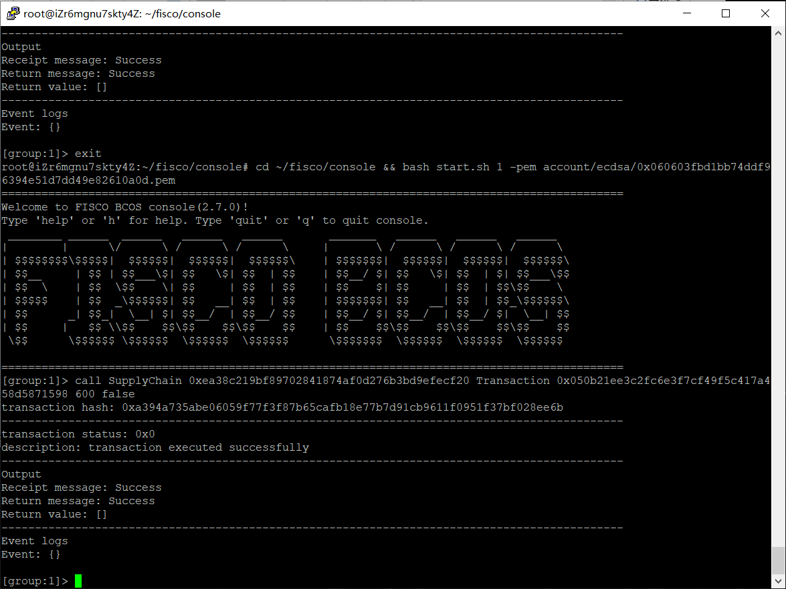
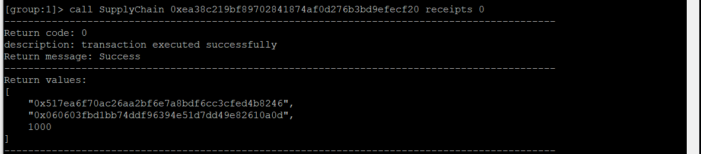
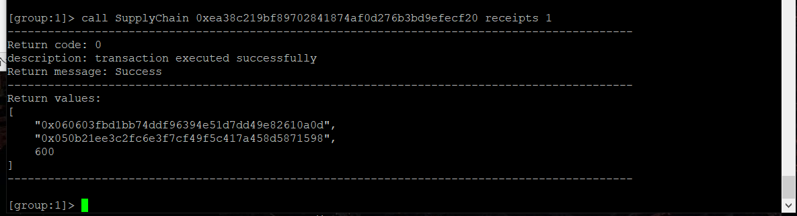
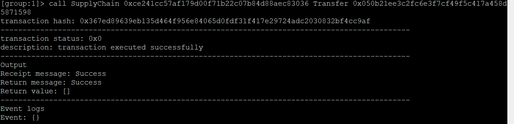
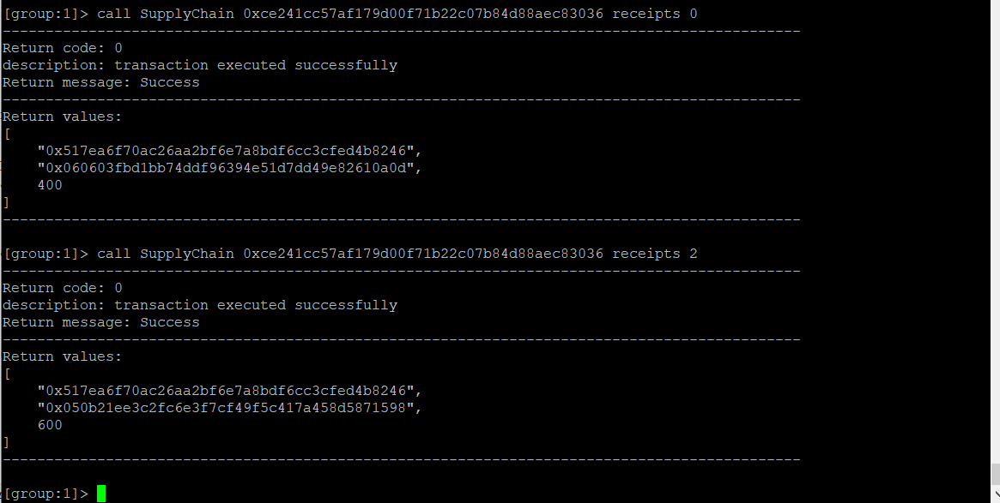
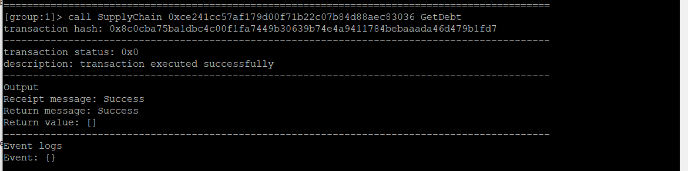
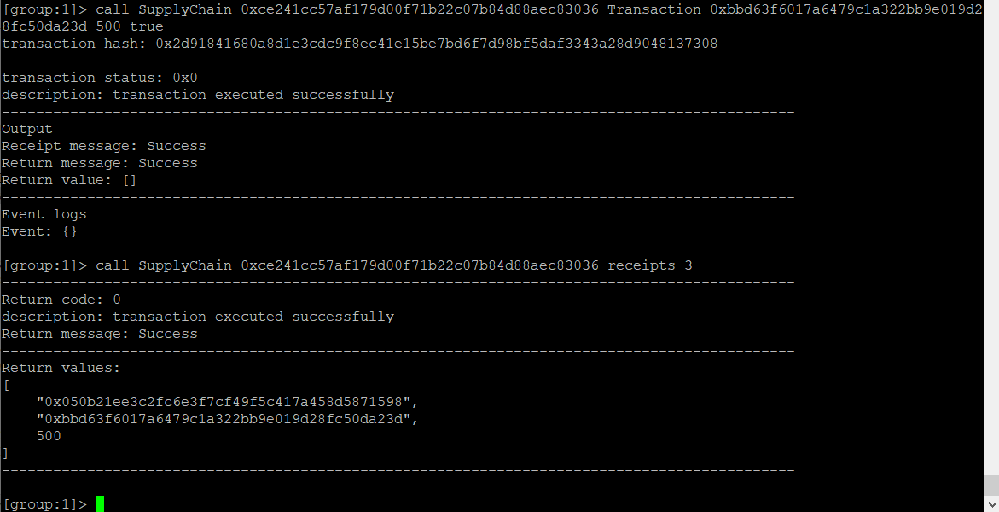
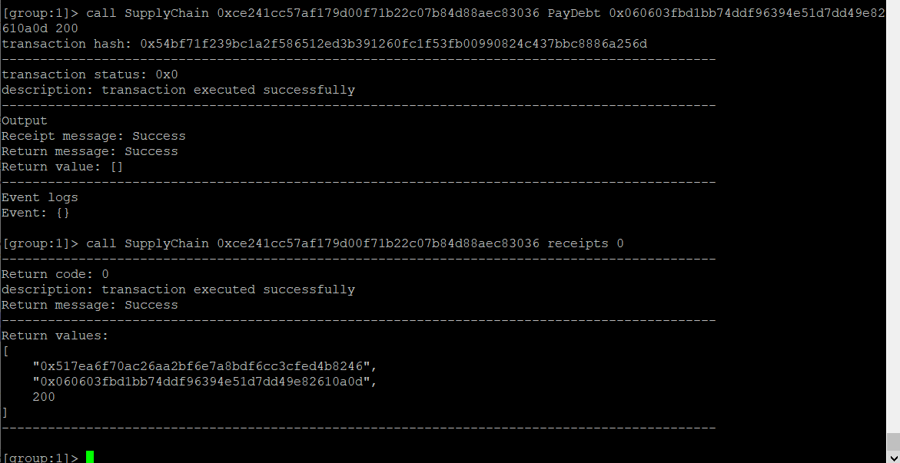

# 区块链原理与技术

## 最终制品

##### 姓名：邓俊锋、郭庭浩

##### 学号： 18340032、18340046

##### 学院：数据科学与计算机学院


### 作业记录

#### 项目设计说明

1. 项目背景

   ​		中小微企业是社会经济发展的重要组成部分，对稳增长、惠民生、稳就业具有重要的支撑作用。但在全球范围内，融资难、融资贵也都是困扰各国中小微企业发展的瓶颈。解决中小微企业融资难的问题已经迫在眉睫，只有切实解决中小企业融资问题，才能把中小企业发展的潜在能量发挥出来，使其在经济发展和社会稳定中发挥更大的作用。

   ​		考虑以下场景：某车企（宝马）因为其造车技术特别牛，消费者口碑好，所以其在同行业中占据绝对优势地位。因此，在金融机构（银行）对该车企的信用评级将很高，认为他有很大的风险承担的能力。在某次交易中，该车企从轮胎公司购买了一批轮胎，但由于资金暂时短缺向轮胎公司签订了1000万的应收账款单据，承诺1年后归还。然而，这种信任关系并不会向下游传递。比如，轮胎公司因资金短缺，向轮毂公司签订了 500 万的应收账款单据，但是当轮毂公司需要贷款时，金融机构因不认可轮胎公司的还款能力，需要对轮胎公司进行详细的信用分析，而这会增加很多的经济成本。很多时候，就是这个原因导致了小微企业的融资失败。

   ​		不过，区块链金融可以有效地解决上述问题。将供应链上的每一笔交易和应收账款单据上链，同时引入第三方可信机构来确认这些信息的交易，例如银行，物流公司等，确保交易和单据的真实性。同时，支持应收账款的转让，融资，清算等，让核心企业的信用可以传递到供应链的下游企业，减小中小企业的融资难度。

2. 方案设计

   ​		将供应链上的每一笔交易和应收账款单据上链，同时引入第三方可信机构来确认这些信息的交易，例如银行，物流公司等，确保交易和单据的真实性。同时，支持应收账款的转让，融资，清算等，让核心企业的信用可以传递到供应链的下游企业，减小中小企业的融资难度。

   本实验主要实现四个功能：

   - 功能一：实现采购商品—签发应收账款 交易上链。例如车企从轮胎公司购买一批轮胎并签订应收账款单据。
   - 功能二：实现应收账款的转让上链，轮胎公司从轮毂公司购买一笔轮毂，便将于车企的应收账款单据部分转让给轮毂公司。轮毂公司可以利用这个新的单据去融资或者要求车企到期时归还钱款。
   - 功能三：利用应收账款向银行融资上链，供应链上所有可以利用应收账款单据向银行申请融资。
   - 功能四：应收账款支付结算上链，应收账款单据到期时核心企业向下游企业支付相应的欠款。

#### 功能测试文档

1. 代码实现：

   主要代码在智能合约中实现

   - 相关数据结构

     ```java
         struct company{  
             string name;  
             address adr;  
         }  
         struct receipt{  
             address come;  
             address to;  
             uint amount;  
         }  
         receipt[] public receipts;  
         company[] public companies;  
         mapping(address=>uint) debt;  
     ```

   - 功能一

     ```java
     	function Transaction(address receive,uint amount,bool is_bank){  
             if(is_bank){  
                 GetDebt();  
                 if(debt[msg.sender]<0){  
                     return;  
                 }  
             }  
             receipt memory r;  
             r.come = msg.sender;  
             r.to = receive;  
             r.amount = amount;  
             receipts.push(r);  
         }  
     ```

   - 功能二

     ```java
     	function Transfer(address adr){  
             address adr1 = msg.sender;  
             address adr2 = adr;  
             for(uint i=0;i<receipts.length;i++){  
                 if(receipts[i].come==adr1){  
                     address adr3 = receipts[i].to;  
                     for(uint j=0;j<receipts.length;j++){  
                         if(receipts[j].come==adr3 && receipts[j].to==adr2){  
                             receipts[i].amount -= receipts[j].amount;  
                             receipt memory r;  
                             r.come = adr1;  
                             r.to = adr2;  
                             r.amount = receipts[j].amount;  
                             receipts.push(r);  
                         }  
                     }  
                 }  
             }  
         }  
     ```

   - 功能三

     ```java
         function GetDebt(){  
             uint sum = 0;  
             for(uint i=0;i<receipts.length;i++){  
                 if(receipts[i].come==msg.sender){  
                     sum -= receipts[i].amount;  
                 }  
                 else if(receipts[i].to==msg.sender){  
                     sum += receipts[i].amount;  
                 }  
             }  
             debt[msg.sender] = sum;  
         }  
     ```

   - 功能四

     ```java
         function PayDebt(address receive, uint amount){  
             for(uint i=0;i<receipts.length;i++){  
                 if(receipts[i].come==msg.sender && receipts[i].to==receive){  
                     if(receipts[i].amount-amount>0){  
                         receipts[i].amount-=amount;  
                         break;  
                     }  
                     else if(receipts[i].amount-amount==0){  
                         for(uint j=i;j<receipts.length-1;j++){  
                             receipts[j].come = receipts[j+1].come;  
                             receipts[j].to = receipts[j+1].to;  
                             receipts[j].amount = receipts[j+1].amount;  
                         }  
                     }  
                     else return;  
                 }  
             }  
         }  
     ```

2. 调用结果

   - 先创建对应用户：

     

   - 功能一

     操作为车企欠轮胎厂 1000 万元：

     

     操作为轮胎厂欠轮毂厂 500 万元

     

     可以看见记录成功：

     

   - 功能二

     车企欠轮胎厂的部分金额，转嫁到轮毂厂

     

     现在可以看到车企欠轮胎厂400，欠轮毂厂600

     

   - 功能三

     利用应收账款向银行融资上链

     先获取轮毂厂债务（别人欠他多少）

     

     再向银行借钱500。只要无欠款就能贷款

     

     可以看到轮毂厂借了银行500

   - 功能四

     车厂还轮胎厂200，可以看到借款单上就从400变成了200

     

   

   

#### 总结

这个实验看起来好像挺简单，实际动手实现起来还是有不少细节需要仔细斟酌的。 

花费最多时间考虑的是第二个功能——应收账款转让。一开始我们觉得这个函数调用的主体应该是那些 需要转移应收账款的中小型企业。为了方便描述我们假定以下场景：大企业A欠了小企业B 100万，而小 企业B也欠了另一企业C 50万。在这种情况下，A将还100万给企业B，然后B还要再麻烦一趟，还50万 给企业C。我们仔细思考之后，觉得这种方式十分麻烦，B在其中即充当收款人又充当付款人，显然在实 际生活中去银行付款总是比躺在收钱要麻烦许多，特别是金额很大的时候。 

把函数主体改成了大企业后，大企业A就知道它将把50万还给小企业B，另50万还给另一企业C，而不是 全部给小企业B。如果能应用到实际生产中，这种方式我们认为要比前一种效率高。 

这次作业也激发了我们思考实际生产中的金融交易方式中存在的缺陷，通过这次实验，能更深刻的体会 到区块链对于金融行业在解决信任问题（就像作业中账款转移那样，这对于中小型企业融资十分有 利）、提升账目灵活度等方面具有巨大优势，在未来肯定会有更广阔的应用前景。